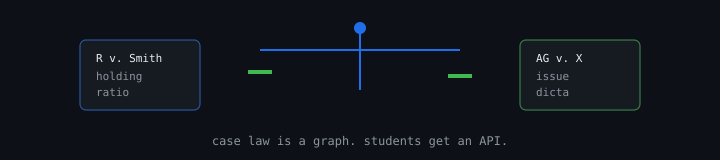

<div align="center">

# ⚖️ Juriscore




### Smarter Legal Research for Kenyan Law Students

[](https://opensource.org/licenses/MIT)
[](https://reactnative.dev/)
[](https://fastapi.tiangolo.com/)
[](https://supabase.com/)
[](https://expo.dev/)

---

**Juriscore** is a purpose-built legal research mobile application designed for Kenyan law students and early-career legal practitioners. It streamlines the process of finding, analyzing, and organizing case law, statutes, and constitutional provisions.

<p align="center">
  <a href="#-features">Features</a> •
  <a href="#-screenshots">Screenshots</a> •
  <a href="#-quick-start">Quick Start</a> •
  <a href="#-deployment">Deployment</a> •
  <a href="#-license">License</a>
</p>

---

## ✨ Features

<table>
  <tr>
    <td width="50%" valign="top">
      <h3>🔍 Smart Case Search</h3>
      <p>Search and filter cases by keyword, court level, year, judge, or legal subject area</p>
      <h3>📋 Structured Case Briefs</h3>
      <p>Automated summaries including facts, issues, holdings, ratio decidendi, and obiter dicta</p>
    </td>
    <td width="50%" valign="top">
      <h3>⚖️ Case Comparison</h3>
      <p>Side-by-side comparison of two cases with key differences highlighted</p>
      <h3>📖 Citation Generator</h3>
      <p>Properly formatted eKLR citations ready for submission</p>
    </td>
  </tr>
  <tr>
    <td width="50%" valign="top">
      <h3>🏛️ Constitution Hub</h3>
      <p>Browse the Constitution of Kenya (2010) with chapter-level navigation</p>
      <h3>🧠 Flashcard System</h3>
      <p>Study with spaced-repetition flashcards organized by legal subject</p>
    </td>
    <td width="50%" valign="top">
      <h3>📓 Research Notebook</h3>
      <p>Save cases and take notes organized in folders</p>
      <h3>📄 PDF Export</h3>
      <p>Export case briefs, comparisons, and statutes as PDF files</p>
    </td>
  </tr>
</table>

---

## 📸 Screenshots

<div align="center">

| Home | Search | Case Detail | Document Viewer |
|:---:|:---:|:---:|:---:|
|  |  |  |  |

</div>

> 📱 Replace placeholder images with actual screenshots from the app

---

## 🛠️ Tech Stack

<div align="center">

| Layer | Technology | Purpose |
|:-----:|:----------:|:-------:|
| **Frontend** |  | Mobile UI Framework |
| **Backend** |  | API Server |
| **Database** |  | Data Storage |
| **Auth** |  | Authentication |
| **Scraping** |  | Web Crawling |

</div>

---

## 🚀 Quick Start

### Prerequisites


### 1️⃣ Backend Setup

```bash
cd backend
pip install -r requirements.txt
cp .env .env.backup  # Edit .env with your credentials
uvicorn main:app --reload
```

<div align="center">

📖 API Documentation: [http://localhost:8000/docs](http://localhost:8000/docs)

</div>

### 2️⃣ Frontend Setup

```bash
cd frontend
npm install
cp .env .env.backup  # Edit .env with your Supabase credentials
npx expo start
```

### 3️⃣ Database Setup

1. Create a Supabase project at [supabase.com](https://supabase.com)
2. Run the SQL migration in Supabase SQL Editor:
   ```sql
   -- Copy contents of supabase/migrations/001_initial_schema.sql
   -- Execute in SQL Editor
   ```
3. Seed sample data:
   ```bash
   cd backend
   python -m database.seed_data
   ```

### 4️⃣ Docker (Optional)

```bash
docker-compose up
```

---

## 🌐 Deployment

### Frontend → Vercel

<div align="center">

[](https://vercel.com/new/clone?repository-id=https://github.com/ishiidoc96-ship-it/juriscore)

</div>

1. Push to GitHub
2. Connect repo to [Vercel](https://vercel.com)
3. Set root directory to `frontend`
4. Framework: Expo
5. Deploy

### Backend → Render / Railway

<div align="center">

[](https://render.com/deploy)

</div>

1. Create a new Web Service on [Render](https://render.com) or [Railway](https://railway.app)
2. Connect your GitHub repo
3. Set root directory to `backend`
4. Build command: `pip install -r requirements.txt`
5. Start command: `uvicorn main:app --host 0.0.0.0 --port $PORT`
6. Add environment variables from `.env`

---

## ⚙️ Environment Variables

### Backend (`backend/.env`)

```env
# Supabase Configuration
SUPABASE_URL=https://your-project.supabase.co
SUPABASE_KEY=your-anon-key

# Processing Mode
PROCESSING_MODE=rule-based

# Local Database (fallback)
DATABASE_URL=sqlite+aiosqlite:///./juriscore.db

# KenyaLaw Scraper
KENYALAW_BASE=https://www.kenyalaw.org

# CORS
CORS_ORIGINS=*
```

### Frontend (`frontend/.env`)

```env
# Supabase Configuration
EXPO_PUBLIC_SUPABASE_URL=https://your-project.supabase.co
EXPO_PUBLIC_SUPABASE_ANON_KEY=your-anon-key

# Backend API
EXPO_PUBLIC_API_URL=http://localhost:8000/api
```

---

## 📁 Project Structure

```
juriscore/
├── 📂 backend/
│   ├── main.py              # FastAPI entry point
│   ├── routers/             # API route handlers
│   ├── services/            # Scraper, business logic
│   ├── models/              # Database models & schemas
│   ├── middleware/           # Auth middleware
│   ├── database/            # Seed data
│   └── requirements.txt
│
├── 📂 frontend/
│   ├── app/                 # Expo Router screens
│   │   ├── (tabs)/          # Tab navigation screens
│   │   ├── document.tsx     # In-app document viewer
│   │   └── _layout.tsx      # Root layout
│   ├── lib/
│   │   └── api.ts           # API client
│   ├── package.json
│   └── app.json
│
├── 📂 supabase/
│   └── migrations/          # SQL schema migrations
│
├── docker-compose.yml
└── vercel.json
```

---

## 🤝 Contributing

Contributions are welcome! Please feel free to submit a Pull Request.

1. Fork the repository
2. Create your feature branch (`git checkout -b feature/AmazingFeature`)
3. Commit your changes (`git commit -m 'Add some AmazingFeature'`)
4. Push to the branch (`git push origin feature/AmazingFeature`)
5. Open a Pull Request

---

## ⚠️ Legal Disclaimer

<div align="center">

**This app is a research aid, not a source of legal advice.**

Always verify information against official sources before citing in formal submissions.

</div>

---

## 📄 License

<div align="center">

This project is licensed under the **MIT License** - see the [LICENSE](LICENSE) file for details.

[](https://opensource.org/licenses/MIT)

---

**Built with ❤️ for Kenyan Law Students**

<p align="center">
  <a href="https://github.com/ishiidoc96-ship-it/juriscore">
    
  </a>
  <a href="https://github.com/ishiidoc96-ship-it/juriscore/fork">
    
  </a>
</p>

</div>
